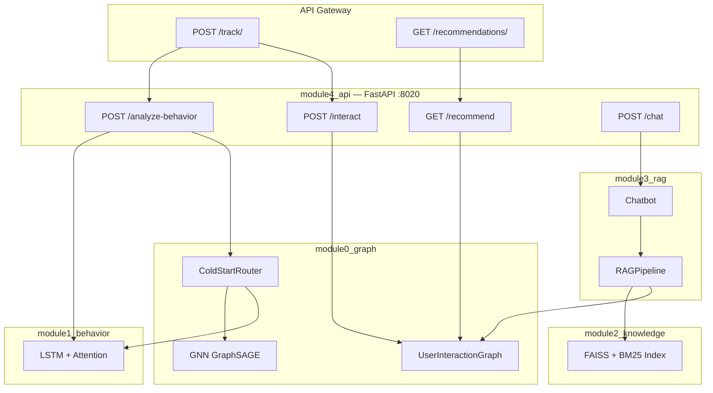
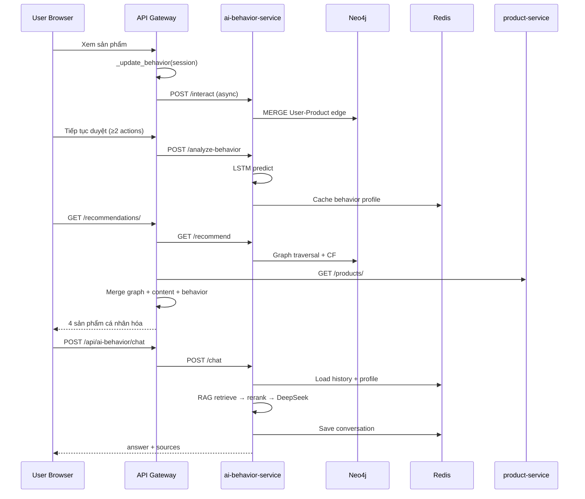

# Luồng hoạt động & cơ chế xử lý AI

Tài liệu mô tả kiến trúc **ai-behavior-service**, cách tích hợp với **api-gateway**, và hai hệ gợi ý AI trong dự án.

---

## 1. Hai hệ thống AI trong dự án

| | **ai-behavior-service** | **recommender-ai-service** |
|---|---|---|
| **Công nghệ** | LSTM, GNN GraphSAGE, Neo4j, RAG (FAISS+BM25), DeepSeek | Rule-based + collaborative filtering trên review |
| **Input** | Session hành vi, tương tác graph, câu hỏi chat | `customer_id`, lịch sử review |
| **Output** | Behavior label, embedding, gợi ý graph, câ trả lời chat | 1 cuốn sách + lý do |
| **Endpoint** | `/api/ai-behavior/*` | `/api/ai/ai-suggest/` |
| **Port nội bộ** | 8020 (FastAPI) | 8000 (Django) |

Phần còn lại của tài liệu tập trung vào **ai-behavior-service** — hệ AI chính.

---

## 2. Kiến trúc module

```
ai-behavior-service/
├── module0_graph/     Neo4j graph, GNN GraphSAGE, Cold Start Router
├── module1_behavior/  LSTM + Attention — phân loại hành vi
├── module2_knowledge/ Knowledge Base (FAISS + BM25)
├── module3_rag/       RAG Pipeline + Chatbot
└── module4_api/       FastAPI REST (entry point)
```

### Sơ đồ phụ thuộc



---

## 3. Module 1 — Phân loại hành vi (LSTM)

### 3.1. Mục đích

Phân loại khách hàng thành **5 nhãn hành vi** từ chuỗi session, phục vụ cá nhân hóa gợi ý và chatbot.

| ID | Label | Mô tả |
|---|---|---|
| 0 | `impulse_buyer` | Mua nhanh, ít cân nhắc |
| 1 | `researcher` | Xem nhiều, so sánh kỹ |
| 2 | `loyal_customer` | Quay lại thường xuyên |
| 3 | `price_sensitive` | Nhạy cảm giá |
| 4 | `window_shopper` | Chỉ xem, ít mua |

### 3.2. Input features (10 chiều × N session)

Mỗi session gồm:

- `click_count`, `view_count`, `purchase_count`
- `time_on_page`, `cart_add_count`, `search_count`
- `session_duration`, `avg_price_viewed`
- `category_diversity`, `return_rate`

Gateway thu thập qua `_update_behavior()` khi frontend gọi `POST /track/`.

### 3.3. Kiến trúc mạng

```
Input (10 features × sessions)
  → Linear(10→64) + BatchNorm + ReLU
  → Bi-LSTM (2 layers, hidden=128, bidirectional)
  → Multi-Head Attention (4 heads)
  → Global Average Pooling
  → Behavior Embedding (128-dim)
  → Classifier → 5 classes
```

### 3.4. Output `/analyze-behavior`

```json
{
  "user_id": "user_42",
  "behavior_profile": {
    "label": "researcher",
    "confidence": 0.87,
    "probabilities": { "impulse_buyer": 0.02, "...": "..." },
    "embedding": [0.12, -0.34, "..."]
  },
  "gnn_info": {
    "source": "warm",
    "user_type": "warm",
    "embedding_dim": 64
  }
}
```

Profile được cache vào **Redis** (hoặc in-memory) cho chatbot và Cold Start Router.

---

## 4. Module 0 — Đồ thị & GNN

### 4.1. User Interaction Graph (Neo4j)

**Schema:**

```
(:User {id}) -[:VIEWED|ADDED_TO_CART|PURCHASED {weight, count, last_seen}]-> (:Product {id, type, name})
```

**Trọng số hành động:**

| Action | Weight |
|---|---|
| view, click, search | 1 |
| price_check | 2 |
| add_to_cart | 3 |
| purchase | 5 |

**Endpoint:** `POST /interact`

Gateway gọi fire-and-forget (timeout 1s) sau mỗi lần `POST /track/` có thông tin sản phẩm. Neo4j offline → trả `stored: false`, không ảnh hưởng UX.

### 4.2. Thuật toán gợi ý graph — `GET /recommend`

Ba bước scoring:

1. **Direct history:** `graph_score = Σ(weight × count)` cho sản phẩm user đã tương tác
2. **Collaborative filtering (1 hop):** User → Product → User₂ → Product₂
3. **Hybrid:** `final_score = (graph_score + 0.5 × collab_score) × behavior_boost`

**Behavior boost** (ví dụ):

| Label | Hệ số |
|---|---|
| impulse_buyer | 1.4× |
| loyal_customer | 1.3× |
| window_shopper | 0.9× |

### 4.3. GNN GraphSAGE

- Học embedding trên **heterogeneous graph** (sách, quần áo, quan hệ category/brand...)
- Train qua `POST /gnn/train` (background task)
- Sau train: cosine similarity giữa product embeddings → `/gnn/product/{id}/similar`

### 4.4. Cold Start Router

Quyết định nguồn embedding cho user mới:

```
User có behavior profile?
  ├─ CÓ  → "warm"     → GNN + LSTM context
  └─ KHÔNG → "cold"
       ├─ Có session data → "cold_lstm"  → LSTM inference
       └─ Không có gì      → "cold_mean" → mean product embedding
```

Endpoint: `POST /gnn/user/embedding`

---

## 5. Module 2 & 3 — RAG Chatbot

### 5.1. Knowledge Base (Module 2)

- Nguồn: file JSON/text trong `module2_knowledge/knowledge_base/`
- Chunking: 500 ký tự, overlap 50
- Embedding: `paraphrase-multilingual-MiniLM-L12-v2`
- Index: **FAISS** (vector) + **BM25** (keyword) — hybrid search
- Brand alias expansion (vd: "LV" → "Louis Vuitton")

### 5.2. RAG Pipeline (Module 3)

Luồng xử lý mỗi câu hỏi:

```
1. Hybrid Retrieve
   ├─ FAISS top-K vectors
   ├─ BM25 top-K keywords
   └─ GraphRetriever (Neo4j) — nếu có

2. Cross-Encoder Rerank
   └─ mmarco-mMiniLMv2 (đa ngôn ngữ, hỗ trợ tiếng Việt)

3. Augment prompt
   ├─ Top documents sau rerank
   ├─ Behavior profile (label, confidence)
   └─ Conversation history (Redis, max 10 turns)

4. Generate
   └─ DeepSeek API (deepseek-chat) hoặc mock nếu thiếu API key
```

### 5.3. Chatbot session

Class `Chatbot` quản lý:

- **ConversationMemory** — Redis key `chat:history:{user_id}`, TTL 1 giờ
- **BehaviorProfileCache** — Redis key `behavior:profile:{user_id}`, TTL 2 giờ

**Endpoint:** `POST /chat`

```json
// Request
{ "user_id": "user_42", "message": "So sánh Clean Code và Pragmatic Programmer" }

// Response
{
  "message_id": "a1b2c3d4",
  "answer": "...",
  "sources": ["chunk_id_1", "..."],
  "behavior_label": "researcher",
  "user_id": "user_42"
}
```

Cá nhân hóa: system prompt điều chỉnh tone theo label (impulse → ngắn gọn, khuyến mãi; researcher → chi tiết, so sánh).

---

## 6. Tích hợp API Gateway

### 6.1. Thu thập hành vi — `POST /track/`

```
Frontend JSON: { "action": "view|search|cart_add|purchase", "product": {...} }

Gateway:
  1. _update_behavior()  → Django session
  2. _get_behavior_label() → gọi /analyze-behavior khi đủ dữ liệu (≥2 view/search)
  3. Forward /interact   → Neo4j (fire-and-forget)
```

**User ID:**

- Đã login: `user_{jwt_user_id}`
- Chưa login: `sess_{session_key}`

### 6.2. Gợi ý trang chủ — `GET /recommendations/`

Ba tầng merge (xem `recommendations_view` trong gateway):

| Tầng | Nguồn | Logic |
|---|---|---|
| 1 | Graph AI | `/recommend?top_k=20` → sắp theo graph score |
| 2 | Content | Ưu tiên `product_type` user vừa xem (`_viewed_types`) |
| 3 | Behavior | `_sort_by_behavior()` theo label LSTM |

Trả về **4 sản phẩm** + `label` + `reason` + `source` (`graph+content` hoặc `content`).

**Sort theo behavior (ví dụ):**

- `price_sensitive` → giá thấp trước
- `researcher` → sách (`book`) trước
- `gift_buyer` → giá cao trước
- Mặc định → shuffle

### 6.3. Xác thực nội bộ

Gateway tự inject header khi proxy tới AI:

```
X-API-Key: bookstore-ai-secret-key-2024
```

Khớp với `API_KEY` trong `ai-behavior-service/.env`.

---

## 7. Luồng end-to-end (sequence)



---

## 8. API Reference — AI Behavior Service

Base URL (Docker): `http://localhost/api/ai-behavior/`

### Core

| Method | Path | Auth | Mô tả |
|---|---|---|---|
| GET | `/health` | Không | Health + component status |
| POST | `/analyze-behavior` | API Key | LSTM classification |
| POST | `/chat` | API Key | RAG chatbot |
| GET | `/user/{id}/profile` | API Key | Profile đã cache |
| POST | `/feedback` | API Key | Rating 1–5 |
| POST | `/clear-session/{id}` | API Key | Xóa chat history |

### Graph

| Method | Path | Auth | Mô tả |
|---|---|---|---|
| POST | `/interact` | API Key | Ghi Neo4j |
| GET | `/recommend` | API Key | Gợi ý graph |
| GET | `/user/{id}/history` | API Key | Debug lịch sử |

Query `/recommend`: `user_id`, `top_k`, `behavior_label`, `exclude_purchased`

### GNN (tùy chọn — cần torch_geometric + model đã train)

| Method | Path | Auth | Mô tả |
|---|---|---|---|
| GET | `/gnn/status` | Không | Model metadata |
| POST | `/gnn/train` | API Key | Trigger training |
| GET | `/gnn/product/{id}/embedding` | API Key | Vector sản phẩm |
| GET | `/gnn/product/{id}/similar` | API Key | Top-K tương tự |
| POST | `/gnn/user/embedding` | API Key | User embedding |

Product ID format GNN: `book:1`, `clothes:3`

---

## 9. Bảo mật & giới hạn

- **API Key:** Header `X-API-Key` bắt buộc (trừ `/health`, `/gnn/status`)
- **Rate limiting:** `setup_rate_limiter(app)` trong FastAPI — chống spam `/chat`
- **Graceful degradation:**
  - Neo4j offline → graph recommend rỗng, gateway fallback content
  - DeepSeek offline → mock response
  - GNN chưa train → chỉ dùng LSTM + graph

---

## 10. Huấn luyện & vận hành model

### LSTM (tự động)

Khi khởi động, nếu chưa có `models/behavior_model.pth`, service tự train (~30 epochs) từ synthetic data.

### GNN (thủ công / admin)

```bash
curl -X POST http://localhost/api/ai-behavior/gnn/train \
  -H "X-API-Key: bookstore-ai-secret-key-2024" \
  -H "Content-Type: application/json" \
  -d '{"epochs": 80, "embedding_dim": 64}'

# Poll status
curl http://localhost/api/ai-behavior/gnn/status
```

### Knowledge Base index

```bash
cd ai-behavior-service
python -m module2_knowledge.kb_builder
```

Index lưu tại `ai-behavior-service/models/` (FAISS + BM25 pickle).

---

## 11. So sánh hai luồng gợi ý

| Tiêu chí | Gateway `/recommendations/` | recommender `/ai-suggest/` |
|---|---|---|
| Phạm vi | Mọi loại sản phẩm | Chỉ sách |
| Dữ liệu | Session + Neo4j graph + LSTM | Review + category |
| Real-time | Có (track mỗi click) | Không (batch trên review) |
| Số kết quả | 4 sản phẩm | 1 sách + reason |
| Use case | Trang chủ, listing | API gợi ý sách theo gu đọc |

---

*Chi tiết endpoint REST toàn hệ thống: [API_Documentation.md](./API_Documentation.md)*
